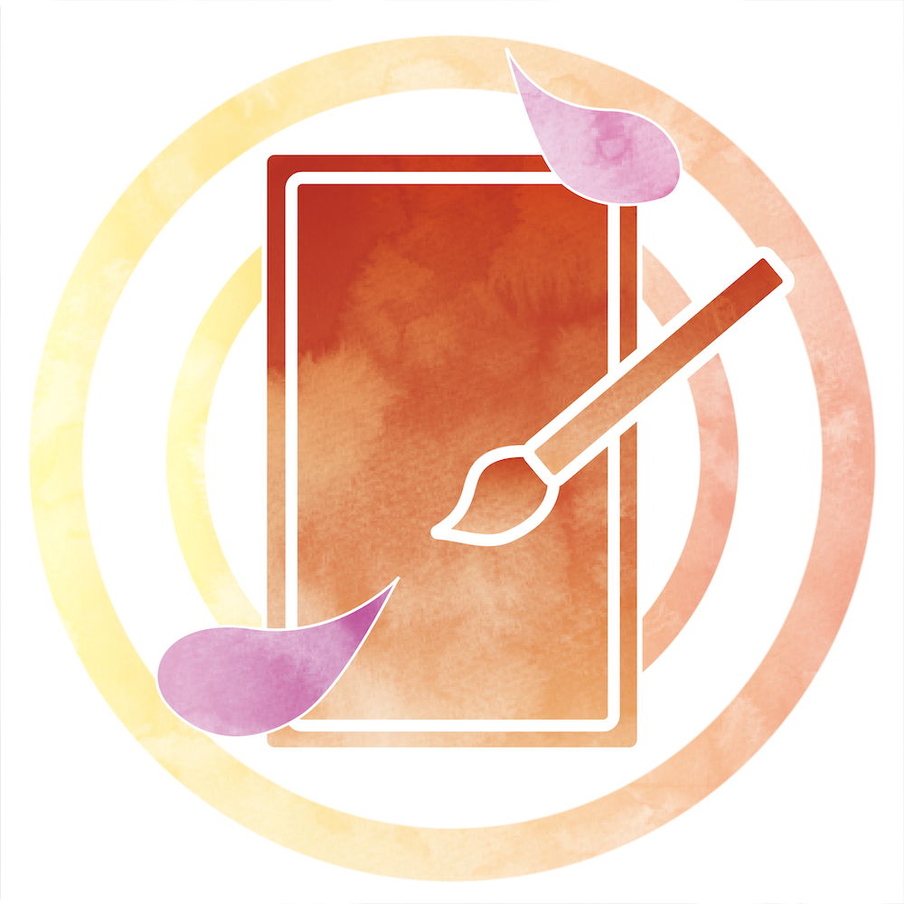
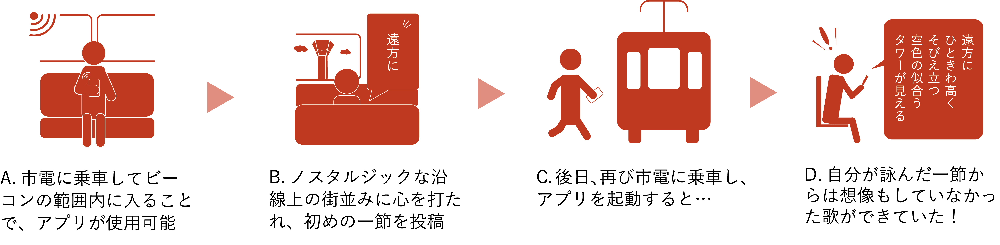
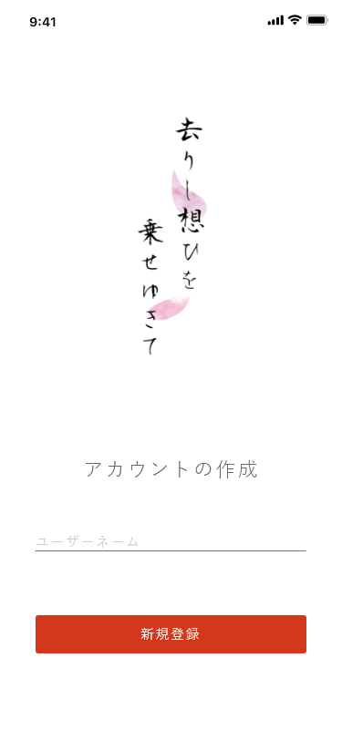
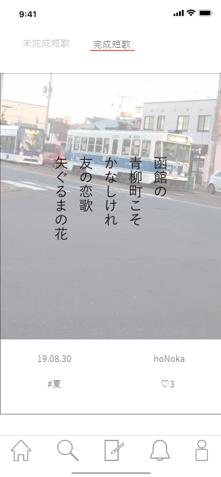
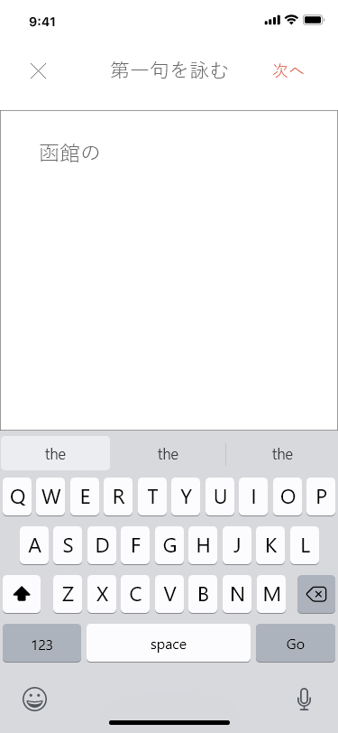

# 去りし想ひを乗せゆきて
> 市電で感じるノスタルジア、貴方とつむぐ三十一文字

[![Swift Version][swift-image]][swift-url]
[](http://cocoapods.org/pods/LFAlertController)

同じ景色を見ていた人と、一つの短歌を作りあげるサービス  
一人一句ずつ言葉を紡ぎ、5人で一首の短歌を完成させる



## 特徴

- [x] ビーコンの利用により、市電内から見た同じ景色への想いを共有できる
- [x] 言葉を繋ぎ、誰かと一つの短歌を作りあげていく楽しみ

## 動作環境

- iOS 13.1+
- Xcode 11.1

## インストール

#### CocoaPods
[CocoaPods](http://cocoapods.org/) を使用して、`Podfile` にライブラリを追加し、インストールすることができます。:

```ruby
platform :ios, '13.0'
use_frameworks!
pod 'Alamofire', '< 5.0'
pod 'SwiftyJSON'
pod 'Tabman'
pod 'Nantes'
pod 'SkeletonView'
pod 'SwiftyGif'
```


## 使用例



## スクリーンショット






[swift-image]:https://img.shields.io/badge/swift-5.0-orange.svg
[swift-url]: https://swift.org/
[license-image]: https://img.shields.io/badge/License-MIT-blue.svg
[license-url]: LICENSE
[travis-image]: https://img.shields.io/travis/dbader/node-datadog-metrics/master.svg?style=flat-square
[travis-url]: https://travis-ci.org/dbader/node-datadog-metrics
[codebeat-image]: https://codebeat.co/badges/c19b47ea-2f9d-45df-8458-b2d952fe9dad
[codebeat-url]: https://codebeat.co/projects/github-com-vsouza-awesomeios-com